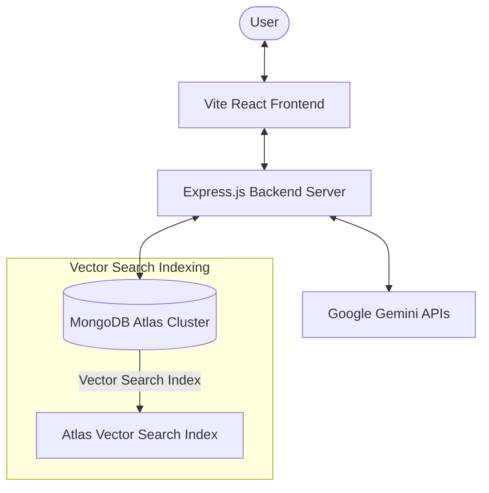
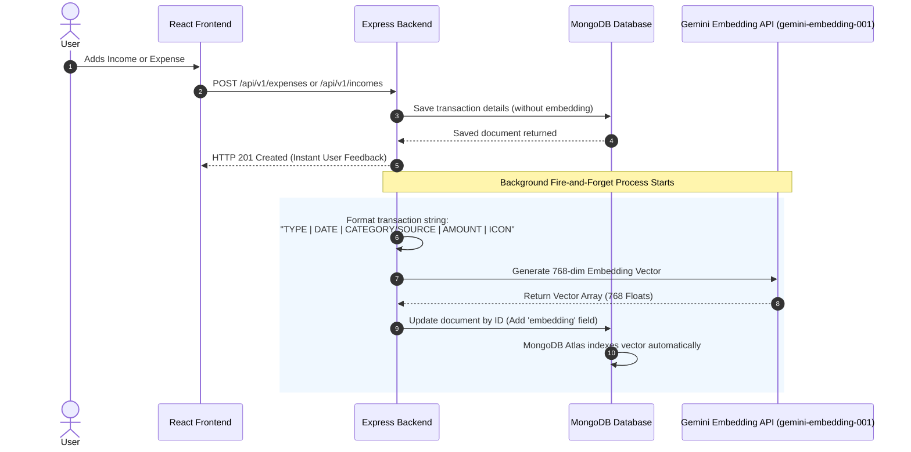
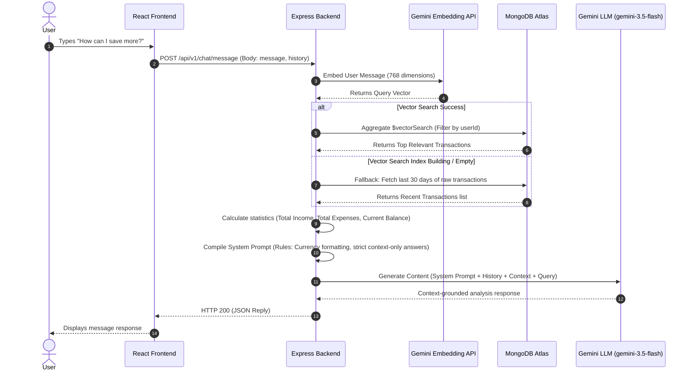

# Personal Expense & Income Management Web Application

## Project Overview

This project is a secure, user-friendly web application for recording, managing, and analyzing personal income and expenses. The application helps individuals overcome poor financial planning by providing an easy, secure way to manage personal finances, replacing manual tracking with modern web and AI technologies.

## Objectives

- To develop a full-stack web application for financial tracking.
- To implement secure user authentication and personalized data storage.
- To provide an interactive dashboard with visual summaries of transactions.
- To integrate a retrieval-augmented generation (RAG) AI Chatbot to act as a personal financial advisor.

## Key Features

- **User Authentication:** Secure registration and login using JSON Web Tokens (JWT) and bcrypt for password hashing.
- **Transaction Management:** Add, view, edit, and delete detailed income and expense records.
- **Categorization with Emojis:** Categorize transactions using a built-in emoji picker for a customized, visually appealing experience.
- **Interactive Dashboard:** Dynamic charts and summaries (spending by category, income vs. expenses) visualized using Recharts.
- **Data Export:** Export financial records as Excel (XLSX) files for external use or record-keeping.
- **File Uploads:** Support for file/image uploads for receipts or profile pictures (via Multer).
- **RAG AI Chatbot (Zen Wealth AI):** An interactive personal financial advisor that analyzes your real transaction history to offer personalized saving tips, budget analysis, and financial insights using Gemini models and MongoDB Atlas Vector Search.
- **Responsive UI:** A modern, mobile-friendly interface built with React and Tailwind CSS v4.

---

## AI Chatbot Workflow & RAG Architecture

The application implements a Retrieval-Augmented Generation (RAG) architecture to ground AI advice in actual user financial data while keeping records completely secure and isolated.

### High-Level Architecture Diagram



### 1. Transaction Event & Embedding Pipeline
Whenever a transaction is created, it is automatically formatted and embedded in the background:



* **Text Formatting**: Transactions are transformed into standard signatures: `EXPENSE | 2026-07-13 | food | 500 | 🍔`
* **Output Dimensionality**: Restricts `gemini-embedding-001` output size to `768` dimensions to match the search index specifications in MongoDB Atlas.

### 2. RAG Query & Chat Retrieval Pipeline
When a user asks a question in the chat interface:



* **Data Isolation**: The `$vectorSearch` stage uses a strict `{ userId: userIdObj }` pre-filter so users only retrieve their own financial records.
* **Accuracy Fallback**: If the search index has not finished building or returns 0 results, the system queries the database for the last 30 days of recent transactions to guarantee grounded response generation.

---

## Technology Stack

### Frontend

- **Framework:** React 19 (built with Vite)
- **Styling:** Tailwind CSS v4
- **Routing:** React Router DOM
- **HTTP Client:** Axios
- **Data Visualization:** Recharts
- **Icons & UI Extras:** React Icons, react-hot-toast, emoji-picker-react

### Backend

- **Environment:** Node.js
- **Framework:** Express.js 5.x
- **Database:** MongoDB (using Mongoose)
- **AI/LLM Stack:** Google Gemini API (`@google/generative-ai` & `@google/genai`)
- **Authentication:** JWT, bcryptjs
- **File Handling:** Multer
- **Data Processing:** SheetJS (xlsx) for exporting records

---

## Project Structure

```text
Personal-Expense-Income-Management-Web-Application/
│
├── backend/                  # Server-side code
│   ├── config/               # Database, vectorStore configurations
│   │   ├── db.js             # MongoDB connection configuration
│   │   └── vectorStore.js    # Semantic embeddings, sync and vector search logic
│   │
│   ├── controllers/          # Business logic for endpoints
│   │   ├── authController.js # Auth actions (Register, Login, UserInfo)
│   │   ├── chatController.js # AI advisor endpoints (Message & Sync)
│   │   ├── expenseController.js
│   │   └── incomeController.js
│   │
│   ├── middleware/           # Custom middlewares
│   ├── models/               # Mongoose schemas (User, Expense, Income)
│   ├── routes/               # Express API routes
│   │   ├── authRoutes.js
│   │   ├── chatRoutes.js     # AI endpoints routes mapping
│   │   ├── expenseRoutes.js
│   │   └── incomeRoutes.js
│   │
│   ├── server.js             # Entry point for the Node.js application
│   └── package.json          # Backend dependencies
│
└── frontend/expense-tracker/ # Client-side React application
    ├── src/                  # React source
    │   ├── components/       # Custom components
    │   ├── pages/            
    │   │   └── Dashboard/
    │   │       ├── AiChat.jsx # AI chat interaction interface page
    │   │       └── ...
    │   └── utils/
    │       └── apiPaths.js   # API route configurations
    └── package.json          # Frontend dependencies
```

---

## Installation & Setup

### Prerequisites

- Node.js (v18 or higher recommended)
- MongoDB instance (local or Atlas cluster with Search Index enabled)
- Google Gemini API Key

### Steps to Run Locally

1. **Clone the repository:**

   ```bash
   git clone <repository-url>
   cd Personal-Expense-Income-Management-Web-Application
   ```

2. **Backend Setup:**

   ```bash
   cd backend
   npm install
   ```

   Create a `.env` file in the `backend` directory with the following variables:

   ```env
   MONGO_URI=<your-mongodb-connection-string>
   JWT_SECRET=<your-custom-jwt-secret>
   PORT=8000
   GEMINI_API_KEY=<your-google-ai-studio-api-key>
   ```

   Start the backend server:

   ```bash
   npm run dev
   ```

3. **Frontend Setup:**
   Open a new terminal window:
   ```bash
   cd frontend/expense-tracker
   npm install
   ```
   Start the Vite development server:
   ```bash
   npm run dev
   ```
