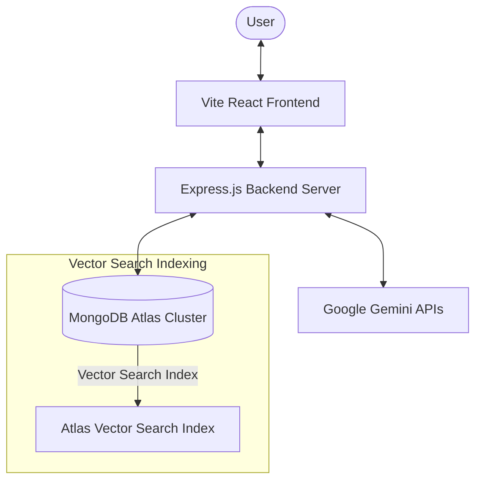
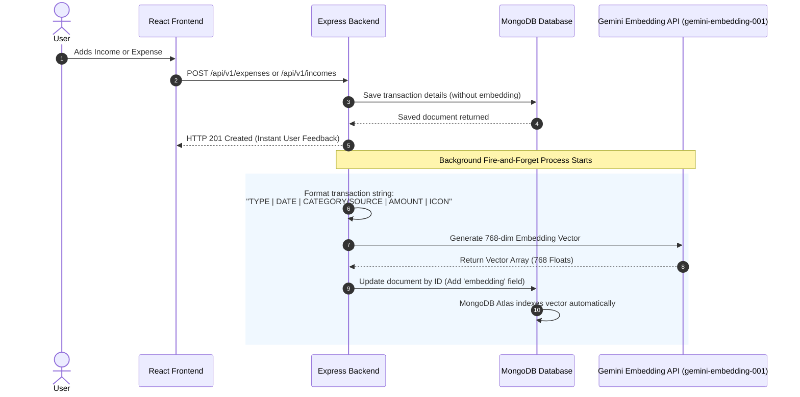
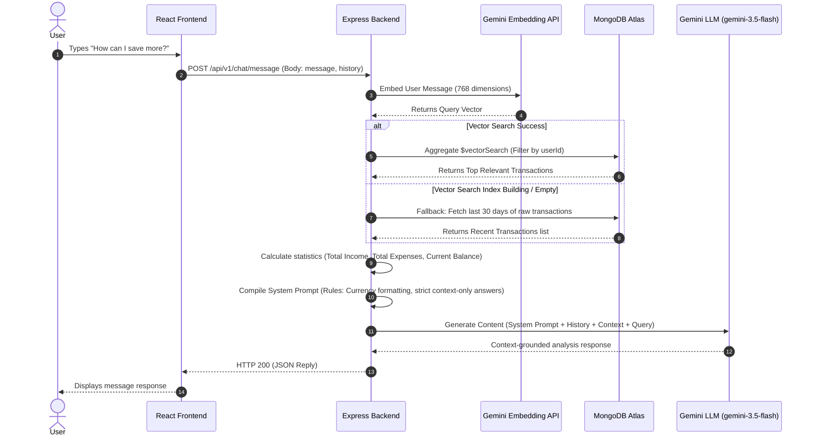

# Chatbot Workflow & Architecture

This document details the end-to-end workflow of the RAG (Retrieval-Augmented Generation) AI Financial chatbot, illustrating how data is processed, indexed, retrieved, and generation-guided using Google's Gemini models and MongoDB Atlas Vector Search.

---

## 1. High-Level Architecture Diagram

---

## 2. Pipeline A: Transaction Event & Embedding Pipeline
Whenever an income or expense is added (via UI or bulk Excel upload), the transaction is formatted, embedded, and indexed.

### Workflow Sequence

### Key Technical Details
* **Standardized Format**: Transaction objects are formatted into a simple, predictable text signature before embedding, e.g.:
  `EXPENSE | 2026-07-13 | food | 500 | 🍔`
* **Output Dimensionality**: The `gemini-embedding-001` model normally outputs $3072$-dimension vectors. We restrict this to **`768`** dimensions using `outputDimensionality: 768` to matches the configuration of the search index in MongoDB Atlas.

---

## 3. Pipeline B: RAG Query & Chat Retrieval Pipeline
When a user asks a question in the chat interface, the system retrieves relevant transactions and feeds them to Gemini.

### Workflow Sequence

### Core Safeguards & Optimizations
1. **Pre-Filtering**: The `$vectorSearch` stage incorporates a strict `{ userId: userIdObj }` pre-filter. Because this field is defined as a `filter` type in the MongoDB index, Atlas restricts vector candidate selection strictly to the current user's records before checking cosine similarity.
2. **Indian Rupees Format**: The system prompt instructs Gemini to formulate numbers in Indian numbering system formatting (e.g., $1,00,000$ instead of $100,000$) and always prefix transactions and totals with the Indian Rupee sign (**₹**).
3. **Accuracy Fallback**: If the vector search yields no results or is unavailable, the fallback standard query retrieves 30 days of recent transactions. This ensures the model remains grounded in actual account statistics, rather than hallucinating account totals.
